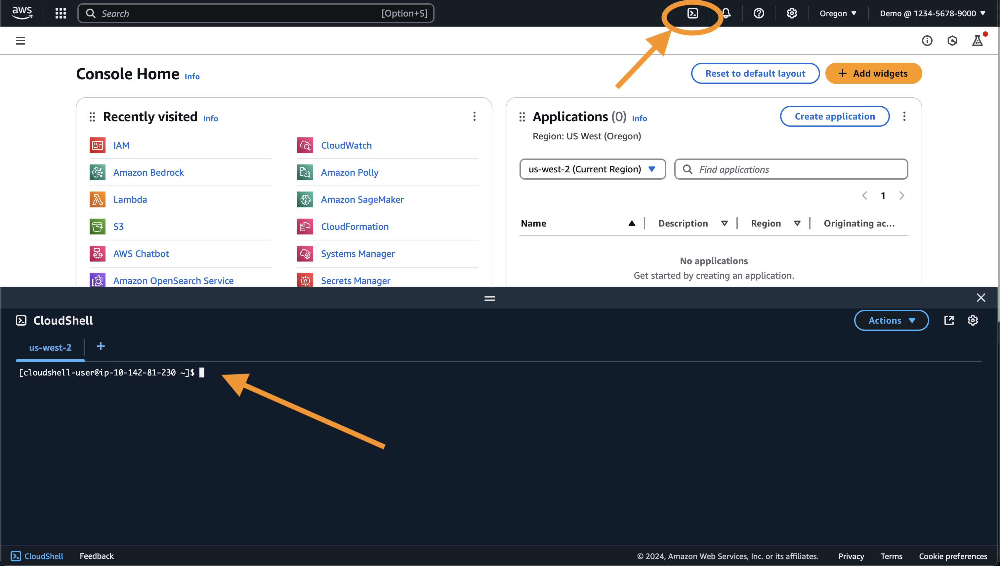
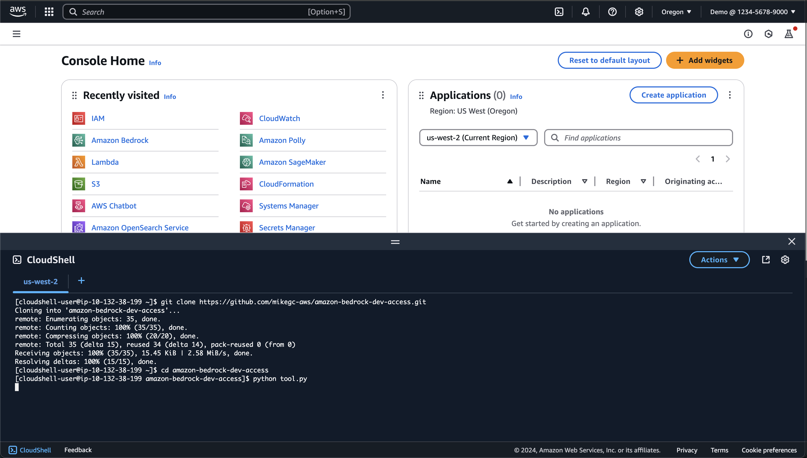
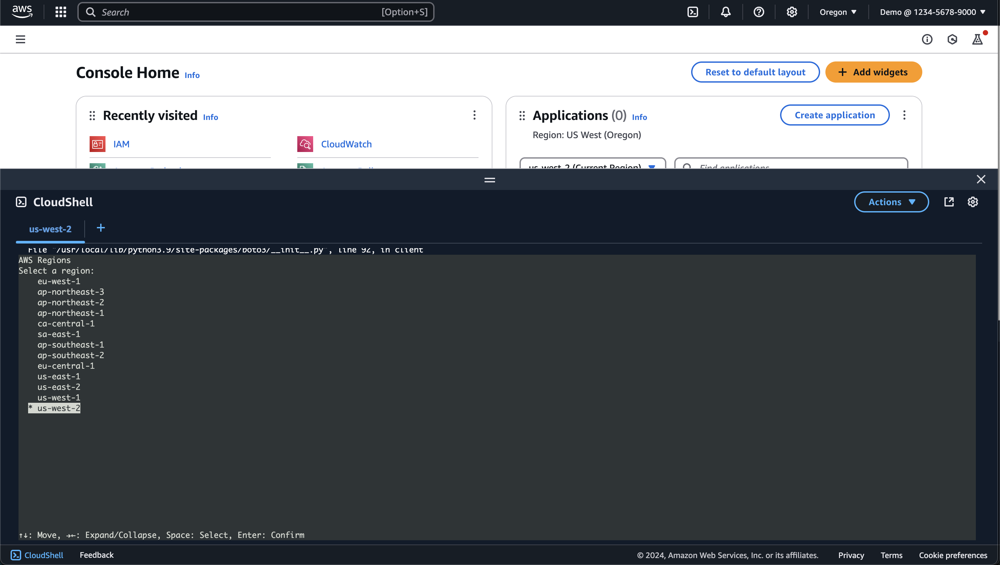
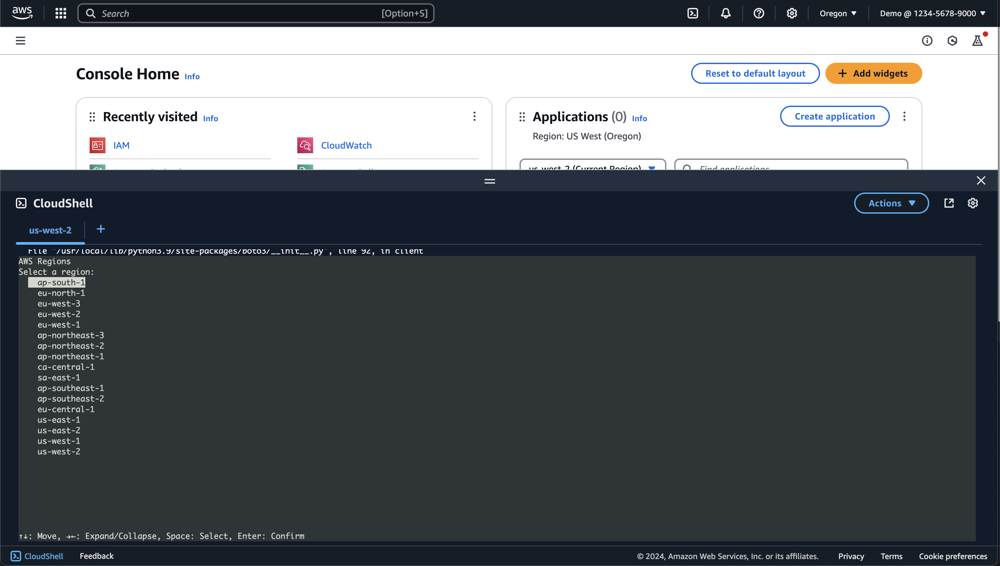
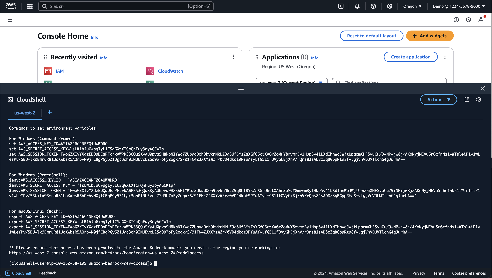

# Amazon Bedrock Developer Access

_**Running an Amazon Bedrock code sample?**_

_**Need access to Bedrock on your local machine?**_ 

_**Use this tool in AWS CloudShell to generate temporary credentials for access to Bedrock models.**_

This repository contains a Python script to help developers quickly set up and test their access to Amazon Bedrock models.

## Overview

The script in this repository automates the process of generating temporary credentials for access to various Amazon Bedrock models. It will create a role and attach the necessary policy to it, then generate temporary credentials for it.

## How to Use with AWS CloudShell

Follow these steps to run the script using AWS CloudShell:

1. Open AWS CloudShell in your AWS Management Console.


1. Clone this repository:
   ```
   git clone https://github.com/mikegc-aws/amazon-bedrock-dev-access.git
   ```

1. Navigate to the cloned repository:
   ```
   cd amazon-bedrock-dev-access
   ```

1. Run the Python script:
   ```
   python tool.py
   ```













(Access keys are temporary and will expire.)

5. You can now use the temporary credentials to access Bedrock models. Paste the credentials into the terminal where you are running for your test code.

## What the Script Does

The `tool.py` script performs the following actions:

1. Creates an IAM role with the necessary permissions to access Amazon Bedrock.
1. Generates temporary credentials for this role.
1. Retrieves a list of all available Bedrock models.
1. Provides information on how to use these credentials to access Bedrock models.

This tool is particularly useful for developers who want to quickly set up access to Bedrock models without having to manually configure IAM roles and policies.

## Requirements

- An AWS account with appropriate permissions to access Amazon Bedrock.
- AWS CloudShell

## Note

Make sure you have the necessary permissions in your AWS account to access Amazon Bedrock services. If you encounter any issues, please check your IAM permissions or contact your AWS account administrator.

In addition, please ensure that access has been granted to the Amazon Bedrock models you need in the region you're working in.
